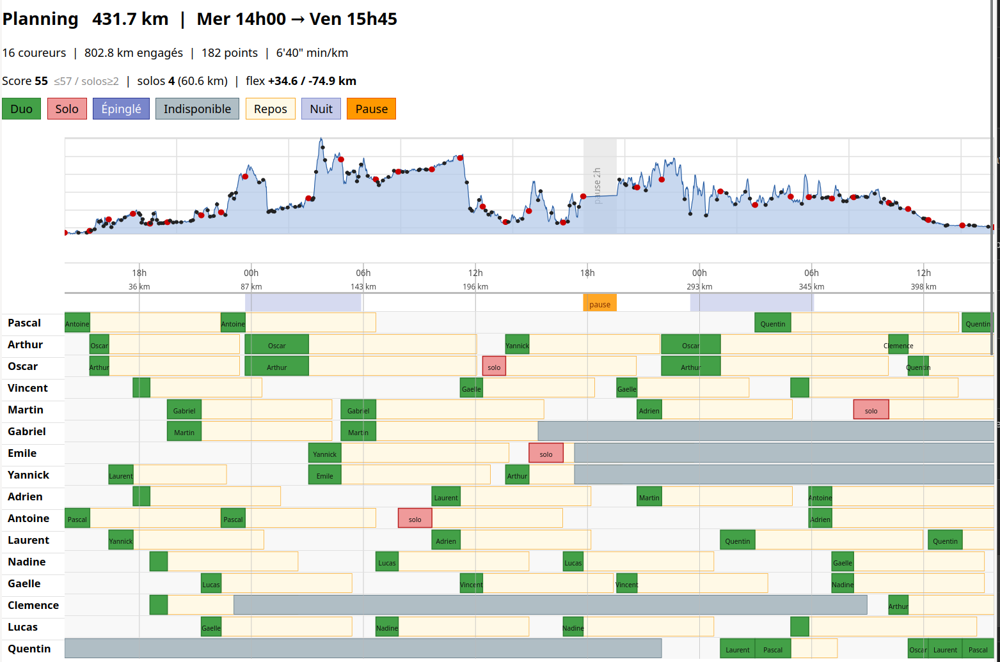

# relais-planner

Planificateur de course en relais par contraintes (CP-SAT).

Problème : Course en relais de ~430 km, ~180 segments élémentaires de longueur variable, vitesse ~9 km/h, départ mercredi 14h00.
15 coureurs doivent couvrir tous les segments, en solo ou en duo.
L'objectif principal est de maximiser un score de compatibilité des binômes.
Les objectifs secondaires sont de minimiser la différence avec une solution connue (replanification) ou de d'optimiser la réparition du D+.




## Prérequis

Python 3.13+, puis (voir aussi [VSCODE_INTEGRATION.md](docs/VSCODE_INTEGRATION.md) pour l'intégration VSCode) :

```bash
python -m venv venv
source venv/bin/activate  # Linux/Mac
# ou : source venv/Scripts/activate  (Windows)
pip install -r requirements.txt
```

## Déclaration des contraintes

Le problème est défini via une API déclarative dans `example.py` :

```python
from relay.constraints import Constraints, Preset
from relay import entry_point

R15 = Preset(km=15, min=13, max=17)
R20 = Preset(km=20, min=16, max=21)

c = Constraints(parcours_gpx="gpx/parcours.gpx", speed_kmh=9.0,
                compat_matrix="compat_coureurs.xlsx", ...)

pascal = c.new_runner("Pascal", lvl=3)
pascal.add_relay(R20).add_relay(R15).add_relay(R15).add_relay(R15)

nuit1 = c.new_shared_relay(R30)       # relais partagé (binôme forcé)
arthur.add_relay(nuit1, window=nuit1_30k)
oscar.add_relay(nuit1, window=nuit1_30k)

entry_point(c)
```

Voir [CONSTRAINTS.md](docs/CONSTRAINTS.md) pour la référence complète de l'API.

## Utilisation

```bash
python example.py                          # résoudre (défaut)
python example.py data                     # résumé des données
python example.py diag                     # diagnostic de faisabilité
python example.py dplus                    # maximiser le D+/D- pondéré par lvl
python example.py solve --min-score 88     # résoudre avec score minimal garanti
python example.py solve --ref hint.json    # résoudre avec hint initial
python example.py replanif --ref ref.json  # replanifier vers une référence
python example.py solve --no-split         # désactiver l'export GPX/KML individuels (activé par défaut)
```

Toutes les options CLI passent par `relay.entry_point()`.

Sur Windows, utiliser `exemple.cmd` (wrapper à la racine du projet) à la place de `python example.py`.

## Structure du projet

`example.py` déclare les paramètres globaux du parcours, les coureurs et leurs relais via l'API du package `relay`, et délègue à `relay.entry_point(c)`.

`relay/` est le package Python actif (modèle à waypoints). Voir [RELAY-PLANNER.md](docs/RELAY-PLANNER.md) pour la description détaillée de chaque module et de l'API publique.

`compat_coureurs.xlsx` contient les scores de compatibilité (0, 1 ou 2) pour chaque paire de coureurs. Passer son chemin directement à `Constraints(compat_matrix=...)` — la lecture est assurée par `relay.compat.read_compat_matrix()`.

## Sorties

| Dossier / fichier                          | Contenu                                                                                       |
|--------------------------------------------|-----------------------------------------------------------------------------------------------|
| `plannings/<ts>_<action>/planning.json`    | Solution JSON (contraintes + relais)                                                         |
| `plannings/<ts>_<action>/planning.csv`     | Planning tabulaire                                                                           |
| `plannings/<ts>_<action>/planning.html`    | Planning HTML avec Gantt                                                                     |
| `plannings/<ts>_<action>/planning.txt`     | Planning texte                                                                               |
| `plannings/<ts>_<action>/planning.gpx`     | Trace GPX globale (si `parcours_gpx=` renseigné)                                            |
| `plannings/<ts>_<action>/split/`           | Fichiers GPX/KML individuels par relais (activé par défaut, `--no-split` pour désactiver)   |

## Workflow typique

1. **Déclarer** les données dans `example.py` et appeler `entry_point(c)`.
2. **Consulter les bornes** (`python example.py data`) : score duo max et nombre de solos minimum théoriques.
3. **Optimiser le score duo** (`python example.py solve`) jusqu'à s'approcher des bornes (30–60 min max).
4. **Sauvegarder** la meilleure solution dans `refs/solution_duos.json`.
5. **Optimiser le dénivelé** (`python example.py dplus --ref refs/solution_duos.json --min-score N`) pour affecter les segments difficiles aux coureurs selon leur `lvl`, en acceptant 1–2 binômes sous-optimaux.
6. **Replanifier** si les données changent en cours de course (`python example.py replanif --ref refs/solution.json`), en épinglant les relais déjà courus.

Voir [WORKFLOW.md](docs/WORKFLOW.md) pour le détail complet.

## Documentation

- [WORKFLOW.md](docs/WORKFLOW.md) — Workflow typique : solve, dplus, replanification
- [CONSTRAINTS.md](docs/CONSTRAINTS.md) — Référence complète de l'API de déclaration des contraintes
- [VSCODE_INTEGRATION.md](docs/VSCODE_INTEGRATION.md) — Configurer l'interpréteur, lancer le solveur depuis VSCode, ajuster `--min-score`
- [USAGE.md](docs/USAGE.md) — Guide d'utilisation détaillé (mode simple, mode avancé, utilitaires)
- [RELAY-PLANNER.md](docs/RELAY-PLANNER.md) — Description des modules du package `relay` et API publique

## Licence

MIT — voir [LICENSE](LICENSE).
